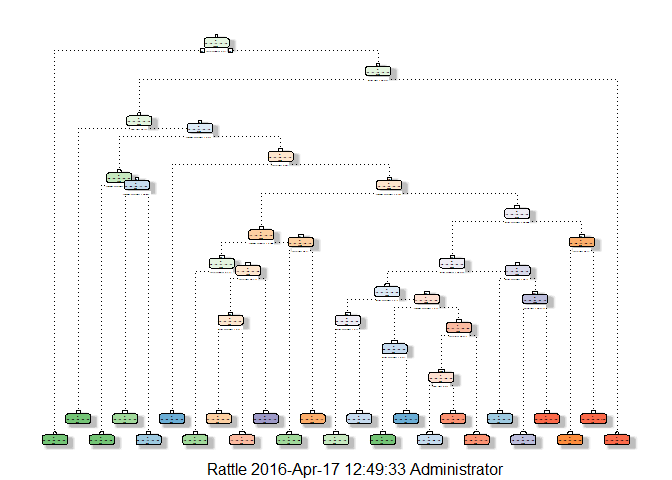
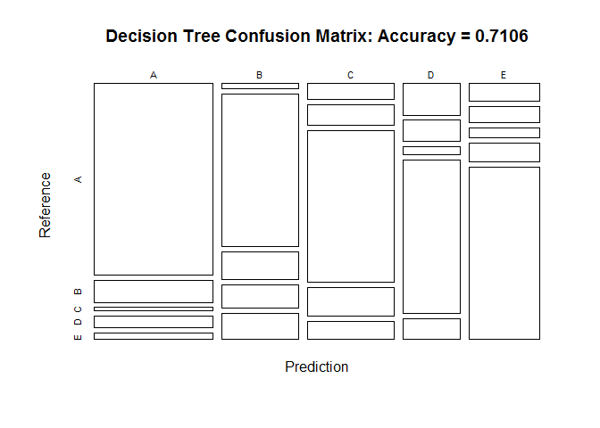
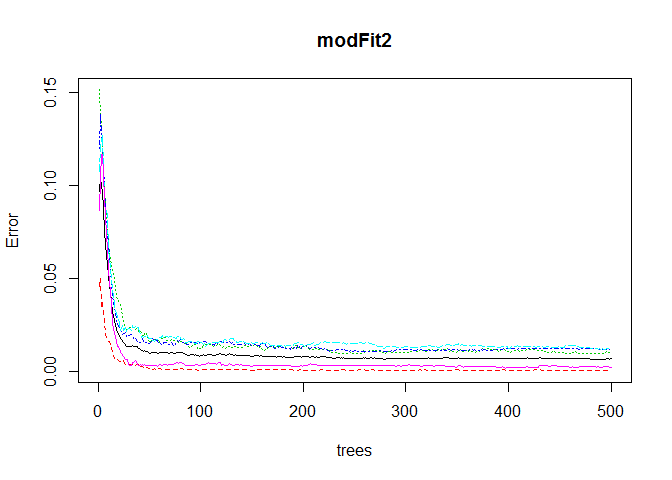
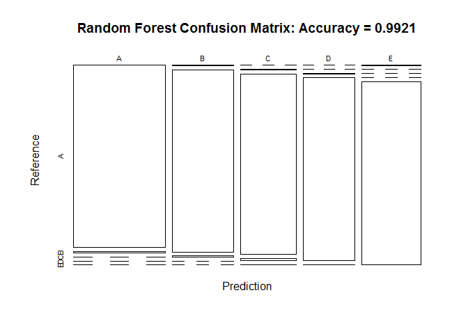

# Model Predicting Exercise Qualtity with Accelerometers
Edwin St Catherine  
April 17, 2016  

#Background Information
Using information from accelorometers on six young health participants who were asked to perform one set of 10 repetitions of the Unilateral Dumbbell Biceps Curl in five different fashions: exactly according to the specification (Class A), throwing the elbows to the front (Class B), lifting the dumbbell only halfway (Class C), lowering the dumbbell only halfway (Class D) and throwing the hips to the front (Class E). The readings from these accelorometers were used to evaluate the quality of the exercise. These readings are considered the predictors to be used in developing a model to predict the quality of the exercises done. More information is available from the website here: http://groupware.les.inf.puc-rio.br/har.

#Synopsis
This modelling exercise utilizes two datasets, a training and test set. These datasets were obtained from the study:
*Velloso, E.; Bulling, A.; Gellersen, H.; Ugulino, W.; Fuks, H. Qualitative Activity Recognition of Weight Lifting Exercises. Proceedings of 4th International Conference in Cooperation with SIGCHI (Augmented Human '13) . Stuttgart, Germany: ACM SIGCHI, 2013.*

In this report we will use various techniques in building machine learning algorithms for prediction of the quality of the exercises down. In the process of doing this we will demonstrate how our model is built, how we used cross-validation in the process of building the algorithms and compute out of sample errors showing the choices we have made. The final model choosen of the three presented (Decision Tree, Random Forest, Boosting) was a Random Forest Model which predicted exercise quality with a 99.43% level of accuracy.

To begin the appropriate packages are loaded:

```r
library(AppliedPredictiveModeling)
library(caret)
library(rpart)
library(rpart.plot)
library(RColorBrewer)
library(rattle)
library(randomForest)
library(gbm)
```

##Source of Input Datasets
The training data for this project were obtained from:
https://d396qusza40orc.cloudfront.net/predmachlearn/pml-training.csv

The test data was also available from:
https://d396qusza40orc.cloudfront.net/predmachlearn/pml-testing.csv

Using these sources we loaded the data

###Downloading and loading datasets
The following commands can be used to download the datafiles download.file(url=url_training, destfile=raw_training, method="curl")
download.file(url=url_testing, destfile=raw_testing, method="curl")
We then import the data treating empty values as NA. Finally, a verification Verify that the column names (excluding classe and problem_id) are identical in the training and test set.

```r
url_training <- "https://d396qusza40orc.cloudfront.net/predmachlearn/pml-training.csv"
raw_training <- "pml-training.csv"
url_testing <- "https://d396qusza40orc.cloudfront.net/predmachlearn/pml-testing.csv"
raw_testing <- "pml-testing.csv"
training <- read.csv(raw_training, na.strings=c("NA",""), header=TRUE)
colnames_train <- colnames(training)
testing <- read.csv(raw_testing, na.strings=c("NA",""), header=TRUE)
colnames_test <- colnames(testing)
all.equal(colnames_train[1:length(colnames_train)-1], colnames_test[1:length(colnames_train)-1])
```

##Partitioning Training Dataset into Training and Testing sets
We were provided with a large training set (19,622 entries) and a small testing set (20 entries). Instead of performing the algorithm on the entire training set the decision was to partition the given training set into two, the original/raw training data set using 60% for training, 40% for testing:

```r
inTrain <- createDataPartition(y=training$classe, p=0.6, list=FALSE)
myTraining <- training[inTrain, ]; myTesting <- training[-inTrain, ]
dim(myTraining); dim(myTesting)
```

```
## [1] 11776   160
```

```
## [1] 7846  160
```

##Preparation of dataset for Modelling
This process involves a check for covariates that have virtually no variablility and these are removed from the dataset. In addition, NA columns and columns where NA consisted of more than 69% of the values in the column are also eliminated, in addition to other extraneous columns. It is also important to ensure that the myTraining, myTesting and the testing datasets contain exactly the same variable names.

```r
nzv <- nearZeroVar(myTraining, saveMetrics=TRUE)
myTraining <- myTraining[,nzv$nzv==FALSE]

nzv<- nearZeroVar(myTesting,saveMetrics=TRUE)
myTesting <- myTesting[,nzv$nzv==FALSE]

nonNAs <- function(x) {
  as.vector(apply(x, 2, function(x) length(which(!is.na(x)))))
}
# Build vector of missing data or NA columns to drop.
colcnts <- nonNAs(myTraining)
drops <- c()
for (cnt in 1:length(colcnts)) {
  if (colcnts[cnt] < nrow(myTraining)) {
    drops <- c(drops, colnames_train[cnt])
  }
}
# Drop NA data and the first 7 columns as they're unnecessary for predicting.
myTraining <- myTraining[,!(names(myTraining) %in% drops)]
myTraining <- myTraining[,8:length(colnames(myTraining))]

myTesting <- myTesting[,!(names(myTesting) %in% drops)]
myTesting <- myTesting[,8:length(colnames(myTesting))]

testing <- testing[,!(names(testing) %in% drops)]
testing <- testing[,8:length(colnames(testing))]

# Show remaining columns.
colnames(myTraining)
```

```
##  [1] "pitch_belt"               "yaw_belt"                
##  [3] "var_pitch_belt"           "avg_yaw_belt"            
##  [5] "stddev_yaw_belt"          "var_yaw_belt"            
##  [7] "gyros_belt_x"             "gyros_belt_y"            
##  [9] "gyros_belt_z"             "accel_belt_x"            
## [11] "accel_belt_y"             "accel_belt_z"            
## [13] "magnet_belt_x"            "magnet_belt_y"           
## [15] "magnet_belt_z"            "pitch_arm"               
## [17] "yaw_arm"                  "total_accel_arm"         
## [19] "var_accel_arm"            "accel_arm_z"             
## [21] "magnet_arm_x"             "magnet_arm_y"            
## [23] "min_yaw_arm"              "skewness_pitch_dumbbell" 
## [25] "max_roll_dumbbell"        "max_picth_dumbbell"      
## [27] "max_yaw_dumbbell"         "min_roll_dumbbell"       
## [29] "min_pitch_dumbbell"       "min_yaw_dumbbell"        
## [31] "amplitude_roll_dumbbell"  "amplitude_pitch_dumbbell"
## [33] "total_accel_dumbbell"     "var_yaw_dumbbell"        
## [35] "gyros_dumbbell_y"         "gyros_dumbbell_z"        
## [37] "accel_dumbbell_x"         "accel_dumbbell_y"        
## [39] "accel_dumbbell_z"         "magnet_dumbbell_x"       
## [41] "magnet_dumbbell_y"        "magnet_dumbbell_z"       
## [43] "roll_forearm"             "pitch_forearm"           
## [45] "yaw_forearm"              "skewness_pitch_forearm"  
## [47] "max_picth_forearm"        "max_yaw_forearm"         
## [49] "min_roll_forearm"         "min_pitch_forearm"       
## [51] "min_yaw_forearm"          "amplitude_roll_forearm"  
## [53] "amplitude_pitch_forearm"  "amplitude_yaw_forearm"   
## [55] "total_accel_forearm"      "var_accel_forearm"       
## [57] "gyros_forearm_x"          "gyros_forearm_y"         
## [59] "gyros_forearm_z"          "accel_forearm_x"         
## [61] "accel_forearm_y"          "accel_forearm_z"         
## [63] "magnet_forearm_x"         "magnet_forearm_y"        
## [65] "magnet_forearm_z"         "classe"
```

```r
# Clean variables with more than 60% NA

trainingV3 <- myTraining
for(i in 1:length(myTraining)) {
  if( sum( is.na( myTraining[, i] ) ) /nrow(myTraining) >= .7) {
    for(j in 1:length(trainingV3)) {
      if( length( grep(names(myTraining[i]), names(trainingV3)[j]) ) == 1)  {
        trainingV3 <- trainingV3[ , -j]
      }   
    } 
  }
}

# Set back to the original variable name
myTraining <- trainingV3
rm(trainingV3)

## Transform the myTesting and testing data sets

clean1 <- colnames(myTraining)
clean2 <- colnames(myTraining[, -40])  # remove the classe column
myTesting <- myTesting[clean1]         # allow only variables in myTesting that are also in myTraining
testing <- testing[clean2]             # allow only variables in testing that are also in myTraining

dim(myTesting)
```

```
## [1] 7846   40
```

```r
dim(testing)
```

```
## [1] 20 39
```

## Building Model with Decision Trees using myTraining Data
The first model is done on the myTraining data created using decision trees and then is cross validated on the myTesting dataset. Using the confusion matrix it is possible to compute statistics on accuracy levels. The model results are then ploted using fancyRpartPlot.

```r
set.seed(123)
modFit1 <- rpart(classe ~ ., data=myTraining, method="class")
fancyRpartPlot(modFit1)
```

```
## Warning: labs do not fit even at cex 0.15, there may be some overplotting
```

<!-- -->

```r
## Using training model modFit1 predict using myTesting
predict1 <- predict(modFit1, myTesting, type = "class")
conmatResults1 <- confusionMatrix(predict1, myTesting$classe)
conmatResults1
```

```
## Confusion Matrix and Statistics
## 
##           Reference
## Prediction    A    B    C    D    E
##          A 1844  214   32  114   65
##          B   31  964  175  146  167
##          C  113  144 1070  202  130
##          D  145  100   36  713   96
##          E   99   96   55  111  984
## 
## Overall Statistics
##                                           
##                Accuracy : 0.7106          
##                  95% CI : (0.7004, 0.7206)
##     No Information Rate : 0.2845          
##     P-Value [Acc > NIR] : < 2.2e-16       
##                                           
##                   Kappa : 0.6336          
##  Mcnemar's Test P-Value : < 2.2e-16       
## 
## Statistics by Class:
## 
##                      Class: A Class: B Class: C Class: D Class: E
## Sensitivity            0.8262   0.6350   0.7822  0.55443   0.6824
## Specificity            0.9243   0.9180   0.9091  0.94253   0.9436
## Pos Pred Value         0.8127   0.6500   0.6450  0.65413   0.7316
## Neg Pred Value         0.9304   0.9129   0.9518  0.91519   0.9295
## Prevalence             0.2845   0.1935   0.1744  0.16391   0.1838
## Detection Rate         0.2350   0.1229   0.1364  0.09087   0.1254
## Detection Prevalence   0.2892   0.1890   0.2114  0.13892   0.1714
## Balanced Accuracy      0.8752   0.7765   0.8456  0.74848   0.8130
```

```r
plot(conmatResults1$table, col = conmatResults1$byClass, main = paste("Decision Tree Confusion Matrix: Accuracy =", round(conmatResults1$overall['Accuracy'], 4)))
```

<!-- -->

##Building Model with Random Forest using myTraining Data

```r
set.seed(123)
modFit2 <- randomForest(classe ~ ., data=myTraining)
## Using training model modFit2 predict using myTesting
predict2 <- predict(modFit2, myTesting)
conmatResults2 <- confusionMatrix(predict2, myTesting$classe)
conmatResults2
```

```
## Confusion Matrix and Statistics
## 
##           Reference
## Prediction    A    B    C    D    E
##          A 2228   21    0    0    0
##          B    3 1493    9    0    0
##          C    0    4 1356   18    1
##          D    0    0    3 1268    2
##          E    1    0    0    0 1439
## 
## Overall Statistics
##                                           
##                Accuracy : 0.9921          
##                  95% CI : (0.9899, 0.9939)
##     No Information Rate : 0.2845          
##     P-Value [Acc > NIR] : < 2.2e-16       
##                                           
##                   Kappa : 0.99            
##  Mcnemar's Test P-Value : NA              
## 
## Statistics by Class:
## 
##                      Class: A Class: B Class: C Class: D Class: E
## Sensitivity            0.9982   0.9835   0.9912   0.9860   0.9979
## Specificity            0.9963   0.9981   0.9964   0.9992   0.9998
## Pos Pred Value         0.9907   0.9920   0.9833   0.9961   0.9993
## Neg Pred Value         0.9993   0.9961   0.9981   0.9973   0.9995
## Prevalence             0.2845   0.1935   0.1744   0.1639   0.1838
## Detection Rate         0.2840   0.1903   0.1728   0.1616   0.1834
## Detection Prevalence   0.2866   0.1918   0.1758   0.1622   0.1835
## Balanced Accuracy      0.9972   0.9908   0.9938   0.9926   0.9989
```

```r
plot(modFit2)
```

<!-- -->

```r
plot(conmatResults2$table, col = conmatResults2$byClass, main = paste("Random Forest Confusion Matrix: Accuracy =", round(conmatResults2$overall['Accuracy'], 4)))
```

<!-- -->

##Predicting Results on the Test Data
Random Forests gave an Accuracy in the myTesting dataset of 99.41%, which was more accurate that what I got from the Decision Trees or GBM. The expected out-of-sample error is 100-99.41 = 0.59%.

```r
prediction2 <- predict(modFit2, testing, type = "class")
prediction2
```

```
##  1  2  3  4  5  6  7  8  9 10 11 12 13 14 15 16 17 18 19 20 
##  B  A  B  A  A  E  D  B  A  A  B  C  B  A  E  E  A  B  B  B 
## Levels: A B C D E
```
